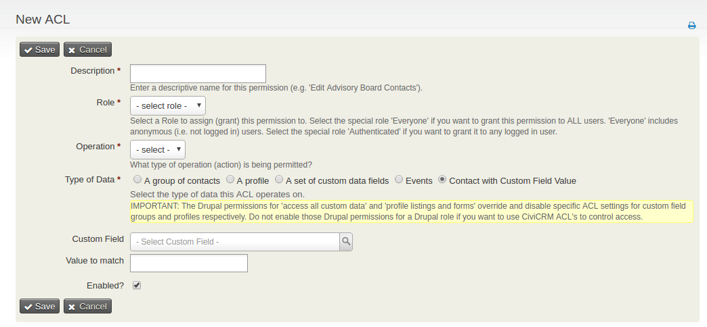

This Extension:

Adds an Option to create an ACL Group based on the value of a custom field by adding a 5th option to the "Type of Data" field (Contact with Custom Field Value). When an Admin selects this option two fields appear one to select a custom field and one to select the value of the custom field. When an Admin saves an ACL Group with "Contact with Custom Field Value" for "Type of Data" and both the custom field and custom field value fields populated a hidden smart group is created that searches for all contacts with the selected custom field value for the custom field selected and permissions accordingly.

